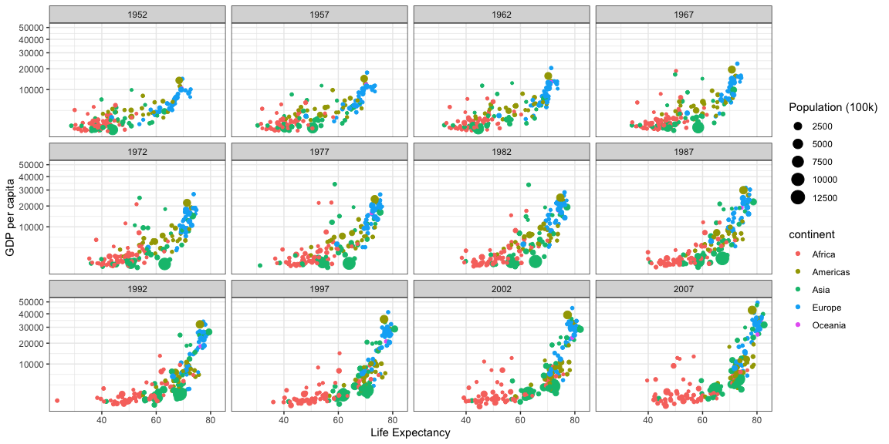
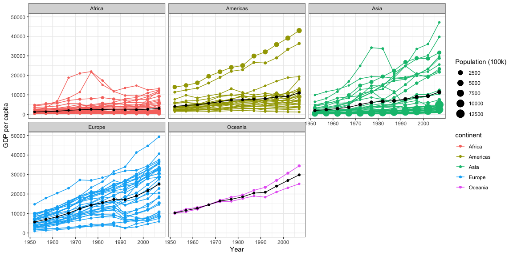

```r
# Use this R-Chunk to import all your datasets!
gap <- gapminder %>% filter(country != "Kuwait")
gap$pop <- gap$pop/100000
```

## Background

This assignment is to recreate a few graphs done by Hans Rosling. I learned how to use the summarise function to group data together and add columns with modified data. I also learned a lot about how to keep adding layers to the base ggplot to get all kinds of lines corresponding to different sources of data.

## Images


### First Plot

```r
# Use this R-Chunk to clean & wrangle your data!
#par(mfrow=c(1,12))
ggplot(data=gap, aes(x=lifeExp,y=gdpPercap, color=continent, size=pop)) +
  geom_point() +
  facet_wrap(vars(year)) +
  scale_y_continuous(trans = "sqrt") +
  labs(y="GDP per capita", x="Life Expectancy", size="Population (100k)") +
  theme_bw()
```

<!-- -->

### Second Plot


```r
averages <- gap %>% 
  group_by(year, continent) %>% 
  summarise(avgGDP = weighted.mean(gdpPercap), avgPop = weighted.mean(pop))

ggplot(data=gap, aes(x=year,y=gdpPercap, color=continent)) +
  geom_point(aes(size=pop)) +
  geom_line(aes(group = country)) +
  facet_wrap(vars(continent)) +
  labs(y="GDP per capita", x="Year", size="Population (100k)") +
  theme_bw() +
  geom_point(data=averages, aes(x=year,y=avgGDP, group=continent,size=avgPop), color="black") +
  geom_line(data = averages, aes( y = avgGDP, x=year, group=continent), color="black")
```

<!-- -->

